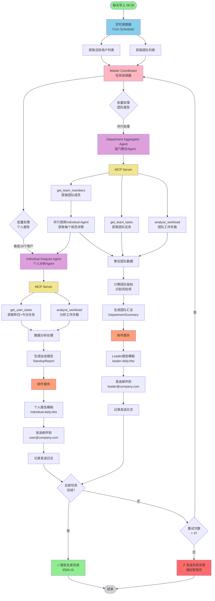
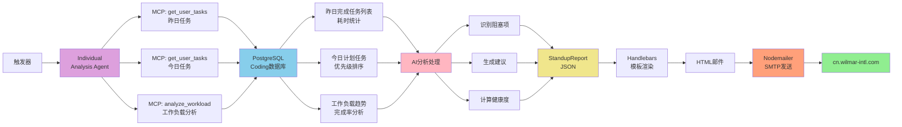
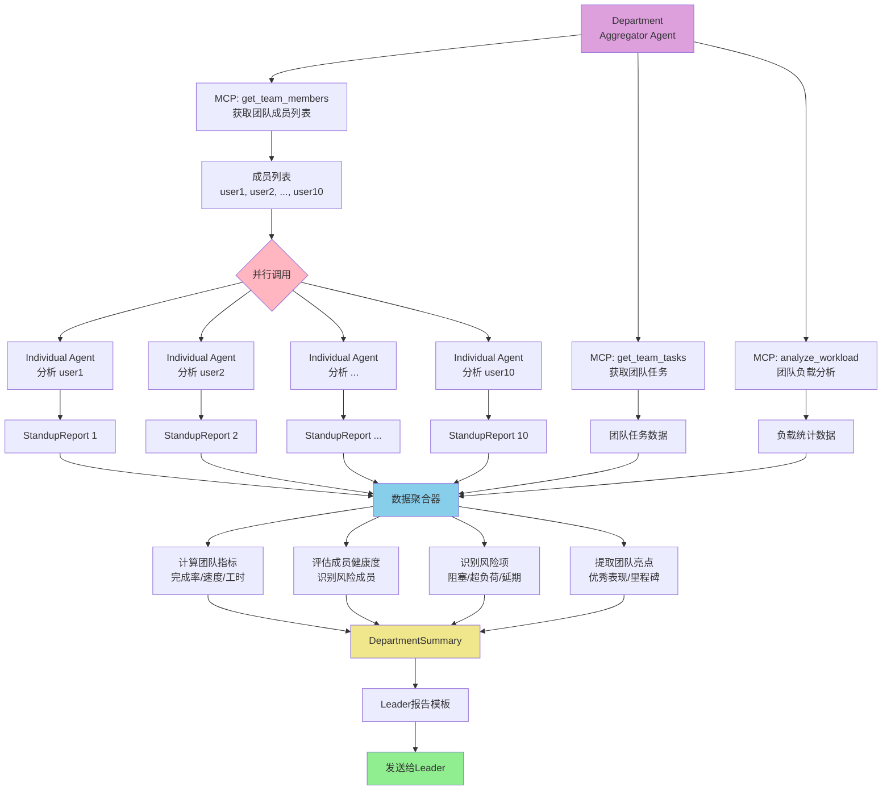
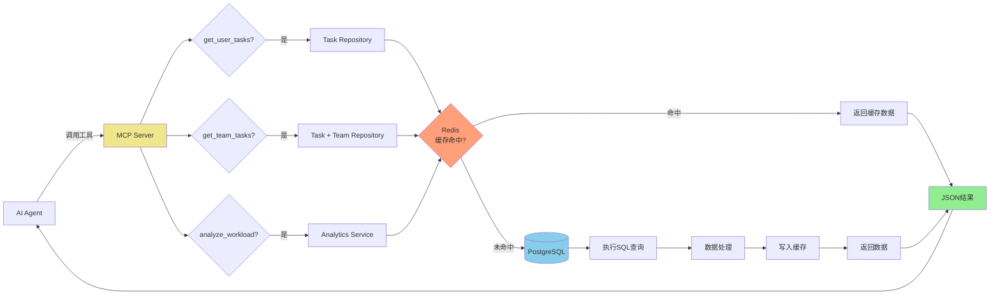
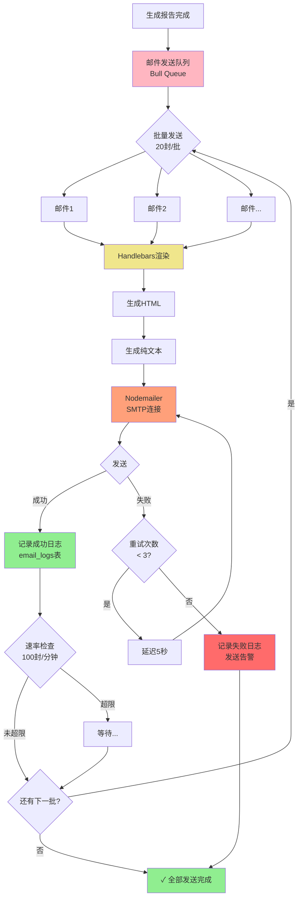
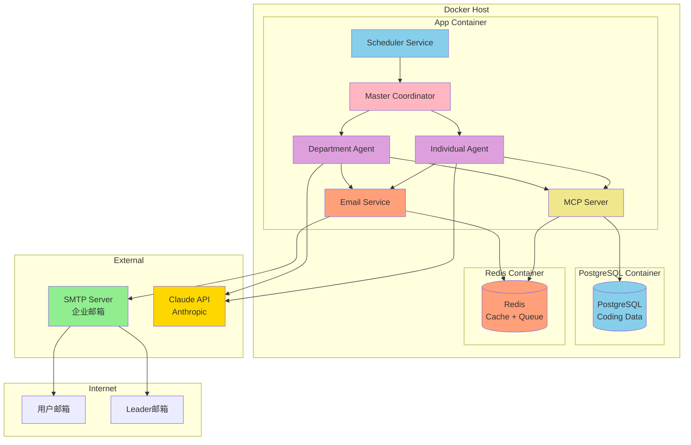
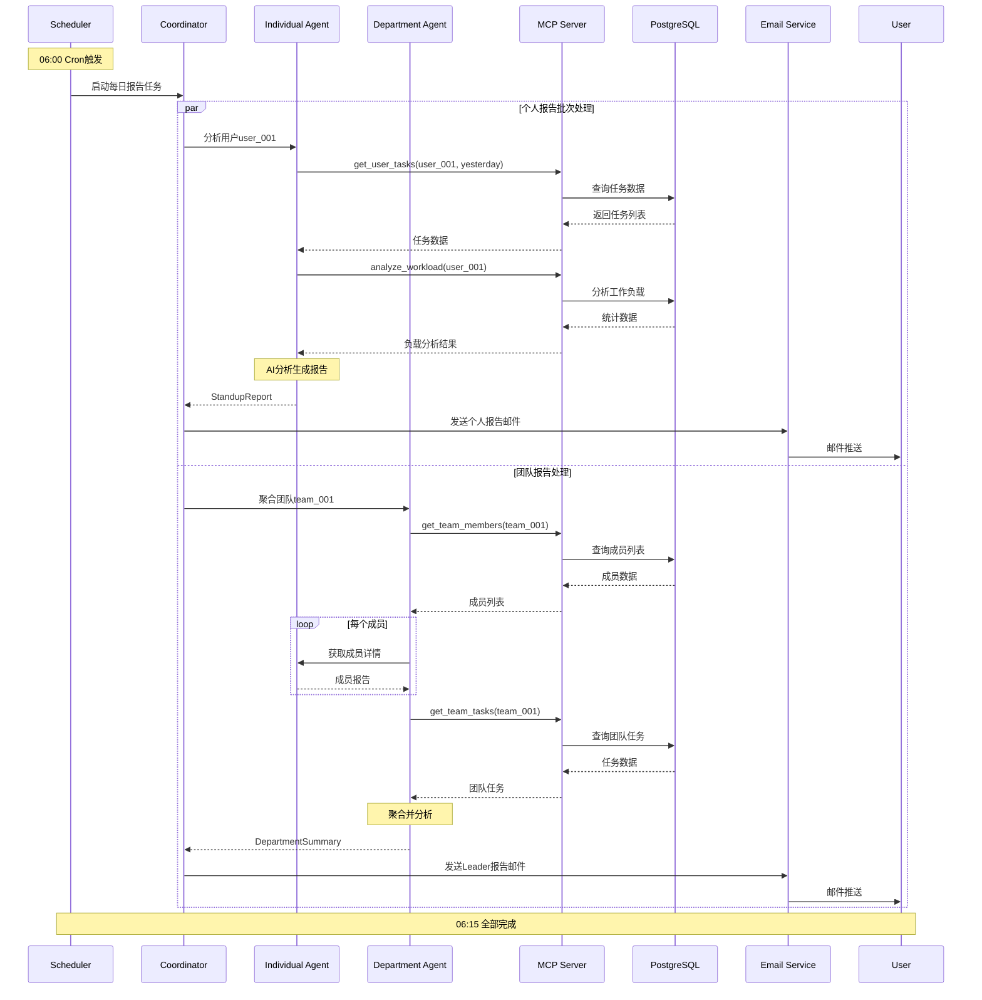
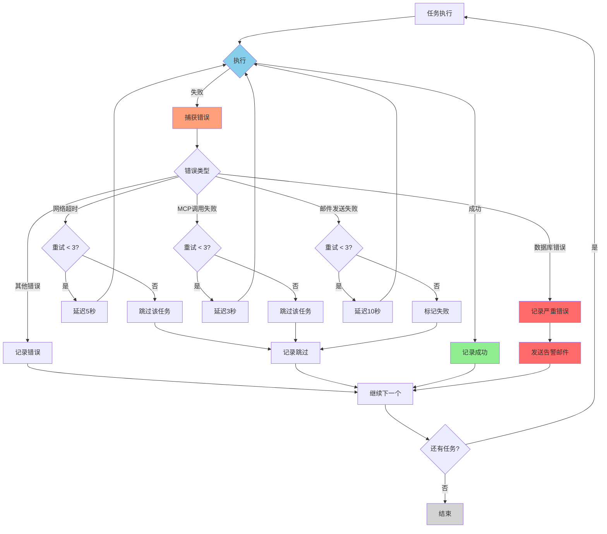

# DevOps Agent - 系统流程图

## 1. MVP整体架构流程图

## 2. 个人报告生成详细流程

## 3. 团队报告聚合流程

## 4. MCP Server工具调用流程

## 5. 邮件发送流程（含队列和重试）

## 6. 定时任务调度详细流程

## 7. 系统部署架构

## 8. 数据流转时序图

## 9. 错误处理流程

---

## 图表说明

1. **图1 - MVP整体架构流程图**: 展示从定时触发到邮件发送的完整流程
2. **图2 - 个人报告生成详细流程**: Individual Agent的具体工作流程
3. **图3 - 团队报告聚合流程**: Department Agent如何并行处理和聚合数据
4. **图4 - MCP Server工具调用流程**: MCP如何处理工具调用并使用缓存
5. **图5 - 邮件发送流程**: 包含队列、批量发送、重试机制
6. **图6 - 定时任务调度详细流程**: Scheduler的完整执行过程
7. **图7 - 系统部署架构**: Docker容器部署结构
8. **图8 - 数据流转时序图**: 展示各组件间的交互时序
9. **图9 - 错误处理流程**: 异常情况的处理逻辑

这些流程图可以直接在支持Mermaid的Markdown查看器中渲染，如GitHub、GitLab、VS Code等。
