# DevOps Agent - 系统流程图

## 1. MVP整体架构流程图（简化版）

```mermaid
flowchart LR
    Start([06:00 定时触发]) --> Scheduler[Cron调度器]

    Scheduler --> Fetch[获取用户/团队列表]

    Fetch --> Process{批量处理}

    Process -->|个人报告| Individual[Individual Agent<br/>分析个人数据]
    Process -->|团队报告| Dept[Department Agent<br/>聚合团队数据]

    Individual --> MCP1[MCP Server<br/>get_user_tasks<br/>analyze_workload]
    Dept --> MCP2[MCP Server<br/>get_team_tasks<br/>get_team_members]

    MCP1 --> DB[(MySQL<br/>Coding数据)]
    MCP2 --> DB

    Individual --> Report1[生成个人<br/>站会报告]
    Dept --> Report2[生成团队<br/>汇总报告]

    Report1 --> Email1[邮件服务]
    Report2 --> Email2[邮件服务]

    Email1 --> User1[📧 发送给个人<br/>user@company.com]
    Email2 --> User2[📧 发送给Leader<br/>leader@company.com]

    User1 --> Done[✓ 完成 06:15]
    User2 --> Done

    style Start fill:#90EE90
    style Scheduler fill:#87CEEB
    style Process fill:#FFB6C1
    style Individual fill:#DDA0DD
    style Dept fill:#DDA0DD
    style MCP1 fill:#F0E68C
    style MCP2 fill:#F0E68C
    style DB fill:#87CEEB
    style Email1 fill:#FFA07A
    style Email2 fill:#FFA07A
    style Done fill:#90EE90
```

## 2. 系统逻辑架构图

```mermaid
graph TB
    subgraph "触发层 Trigger Layer"
        Cron[定时调度器<br/>Cron Scheduler<br/>每天06:00]
    end

    subgraph "协调层 Coordination Layer"
        Master[Master Coordinator<br/>任务协调与分发]
    end

    subgraph "Agent层 Agent Layer"
        IA[Individual Agent<br/>个人数据分析]
        DA[Department Agent<br/>团队数据聚合]
        RA[Report Agent<br/>报告生成<br/>Phase 2]
    end

    subgraph "数据访问层 Data Access Layer"
        MCP[MCP Server<br/>Model Context Protocol]

        subgraph "MCP Tools"
            T1[get_user_tasks]
            T2[get_team_tasks]
            T3[get_team_members]
            T4[analyze_workload]
        end
    end

    subgraph "基础设施层 Infrastructure Layer"
        DB[(MySQL Database<br/>Coding项目数据)]
        Cache[(Redis Cache<br/>缓存+队列)]
        SMTP[SMTP Server<br/>邮件服务]
    end

    subgraph "外部服务 External Services"
        Claude[Claude API<br/>AI分析能力]
        Email[Email Client<br/>用户邮箱]
    end

    Cron -->|触发| Master
    Master -->|调度| IA
    Master -->|调度| DA
    Master -.->|未来| RA

    IA -->|调用| MCP
    DA -->|调用| MCP
    RA -.->|调用| MCP

    MCP --> T1
    MCP --> T2
    MCP --> T3
    MCP --> T4

    T1 -->|查询| DB
    T2 -->|查询| DB
    T3 -->|查询| DB
    T4 -->|查询| DB

    MCP -->|缓存| Cache

    IA -->|AI调用| Claude
    DA -->|AI调用| Claude

    IA -->|发送邮件| SMTP
    DA -->|发送邮件| SMTP

    SMTP -->|推送| Email

    Cache -->|队列管理| SMTP

    style Cron fill:#90EE90
    style Master fill:#FFB6C1
    style IA fill:#DDA0DD
    style DA fill:#DDA0DD
    style RA fill:#E0E0E0
    style MCP fill:#F0E68C
    style DB fill:#87CEEB
    style Cache fill:#FFA07A
    style SMTP fill:#FFA07A
    style Claude fill:#FFD700
    style Email fill:#90EE90
```

## 3. 个人报告生成详细流程

```mermaid
flowchart LR
    A[触发器] --> B[Individual
Analysis Agent]

    B --> C1[MCP: get_user_tasks
昨日任务]
    B --> C2[MCP: get_user_tasks
今日任务]
    B --> C3[MCP: analyze_workload
工作负载分析]

    C1 --> D[MySQL
Coding数据库]
    C2 --> D
    C3 --> D

    D --> E1[昨日完成任务列表
耗时统计]
    D --> E2[今日计划任务
优先级排序]
    D --> E3[工作负载趋势
完成率分析]

    E1 --> F[AI分析处理]
    E2 --> F
    E3 --> F

    F --> G1[识别阻塞项]
    F --> G2[生成建议]
    F --> G3[计算健康度]

    G1 --> H[StandupReport
JSON]
    G2 --> H
    G3 --> H

    H --> I[Handlebars
模板渲染]

    I --> J[HTML邮件]
    J --> K[Nodemailer
SMTP发送]
    K --> L[ user@cn.wilmar-intl.com ]

    style B fill:#DDA0DD
    style D fill:#87CEEB
    style F fill:#FFB6C1
    style H fill:#F0E68C
    style K fill:#FFA07A
    style L fill:#90EE90
```

## 3. 团队报告聚合流程

```mermaid
flowchart TB
    Start[Department
Aggregator Agent] --> GetMembers[MCP: get_team_members
获取团队成员列表]

    GetMembers --> MemberList[成员列表
user1, user2, ..., user10]

    MemberList --> Parallel{并行调用}

    Parallel --> Agent1[Individual Agent
分析 user1]
    Parallel --> Agent2[Individual Agent
分析 user2]
    Parallel --> Agent3[Individual Agent
分析 ...]
    Parallel --> Agent4[Individual Agent
分析 user10]

    Agent1 --> Report1[StandupReport 1]
    Agent2 --> Report2[StandupReport 2]
    Agent3 --> Report3[StandupReport ...]
    Agent4 --> Report4[StandupReport 10]

    Report1 --> Aggregate[数据聚合器]
    Report2 --> Aggregate
    Report3 --> Aggregate
    Report4 --> Aggregate

    Start --> GetTasks[MCP: get_team_tasks
获取团队任务]
    GetTasks --> TeamTasks[团队任务数据]
    TeamTasks --> Aggregate

    Start --> GetWorkload[MCP: analyze_workload
团队负载分析]
    GetWorkload --> WorkloadData[负载统计数据]
    WorkloadData --> Aggregate

    Aggregate --> Calc1[计算团队指标
完成率/速度/工时]
    Aggregate --> Calc2[评估成员健康度
识别风险成员]
    Aggregate --> Calc3[识别风险项
阻塞/超负荷/延期]
    Aggregate --> Calc4[提取团队亮点
优秀表现/里程碑]

    Calc1 --> Summary[DepartmentSummary]
    Calc2 --> Summary
    Calc3 --> Summary
    Calc4 --> Summary

    Summary --> EmailTemplate[Leader报告模板]
    EmailTemplate --> Send[发送给Leader]

    style Start fill:#DDA0DD
    style Parallel fill:#FFB6C1
    style Aggregate fill:#87CEEB
    style Summary fill:#F0E68C
    style Send fill:#90EE90
```

## 4. MCP Server工具调用流程

```mermaid
flowchart LR
    Agent[AI Agent] -->|调用工具| MCP[MCP Server]

    MCP --> Tool1{get_user_tasks?}
    MCP --> Tool2{get_team_tasks?}
    MCP --> Tool3{analyze_workload?}

    Tool1 -->|是| Repo1[Task Repository]
    Tool2 -->|是| Repo2[Task + Team Repository]
    Tool3 -->|是| Repo3[Analytics Service]

    Repo1 --> Cache{Redis
缓存命中?}
    Repo2 --> Cache
    Repo3 --> Cache

    Cache -->|命中| Return1[返回缓存数据]
    Cache -->|未命中| DB[(MySQL)]

    DB --> Query[执行SQL查询]
    Query --> Process[数据处理]
    Process --> CacheWrite[写入缓存]
    CacheWrite --> Return2[返回数据]

    Return1 --> Result[JSON结果]
    Return2 --> Result

    Result --> Agent

    style MCP fill:#F0E68C
    style Cache fill:#FFA07A
    style DB fill:#87CEEB
    style Result fill:#90EE90
```

## 5. 邮件发送流程（含队列和重试）

```mermaid
flowchart TB
    Start[生成报告完成] --> Queue[邮件发送队列
Bull Queue]

    Queue --> Batch{批量发送
20封/批}

    Batch --> Email1[邮件1]
    Batch --> Email2[邮件2]
    Batch --> Email3[邮件...]

    Email1 --> Template[Handlebars渲染]
    Email2 --> Template
    Email3 --> Template

    Template --> HTML[生成HTML]
    HTML --> Text[生成纯文本]

    Text --> SMTP[Nodemailer
SMTP连接]

    SMTP --> Send{发送}

    Send -->|成功| LogSuccess[记录成功日志
email_logs表]
    Send -->|失败| CheckRetry{重试次数
< 3?}

    CheckRetry -->|是| Delay[延迟5秒]
    Delay --> SMTP

    CheckRetry -->|否| LogFail[记录失败日志
发送告警]

    LogSuccess --> RateLimit{速率检查
100封/分钟}

    RateLimit -->|未超限| NextBatch{还有下一批?}
    RateLimit -->|超限| Wait[等待...]
    Wait --> NextBatch

    NextBatch -->|是| Batch
    NextBatch -->|否| Complete[✓ 全部发送完成]

    LogFail --> Complete

    style Queue fill:#FFB6C1
    style Template fill:#F0E68C
    style SMTP fill:#FFA07A
    style LogSuccess fill:#90EE90
    style LogFail fill:#FF6B6B
    style Complete fill:#90EE90
```

## 6. 定时任务调度详细流程

```mermaid
flowchart TB
    Start([系统启动]) --> Init[初始化Scheduler Service]

    Init --> RegisterCron[注册Cron任务
0 6 * * *]

    RegisterCron --> Wait[等待触发...]

    Wait -->|06:00| Trigger[Cron触发]

    Trigger --> Log1[记录开始时间]

    Log1 --> LoadConfig[加载配置
批次大小/并发数]

    LoadConfig --> FetchUsers[查询活跃用户
SELECT * FROM users
WHERE active=true]

    FetchUsers --> FetchTeams[查询所有团队
SELECT * FROM teams]

    FetchTeams --> Split1{用户分批
10个/批}
    FetchTeams --> Split2{团队分批
5个/批}

    Split1 --> ProcessBatch1[处理用户批次1
并发调用Agent]
    Split1 --> ProcessBatch2[处理用户批次2]
    Split1 --> ProcessBatch3[处理用户批次...]

    ProcessBatch1 --> Individual1[Individual Agent × 10]
    ProcessBatch2 --> Individual2[Individual Agent × 10]
    ProcessBatch3 --> Individual3[Individual Agent × N]

    Individual1 --> EmailQueue1[加入邮件队列]
    Individual2 --> EmailQueue1
    Individual3 --> EmailQueue1

    Split2 --> ProcessTeam1[处理团队批次1]
    Split2 --> ProcessTeam2[处理团队批次2]

    ProcessTeam1 --> Dept1[Department Agent × 5]
    ProcessTeam2 --> Dept2[Department Agent × 5]

    Dept1 --> EmailQueue2[加入邮件队列]
    Dept2 --> EmailQueue2

    EmailQueue1 --> SendEmails[发送所有邮件
含速率限制]
    EmailQueue2 --> SendEmails

    SendEmails --> Stats[统计执行结果]

    Stats --> Report[生成执行报告
成功数/失败数/耗时]

    Report --> Notify{有失败?}

    Notify -->|是| Alert[发送告警
给管理员]
    Notify -->|否| LogSuccess[记录成功日志]

    Alert --> Cleanup
    LogSuccess --> Cleanup[清理临时数据]

    Cleanup --> End([结束
约06:15])

    End --> Wait

    style Trigger fill:#90EE90
    style ProcessBatch1 fill:#FFB6C1
    style ProcessBatch2 fill:#FFB6C1
    style ProcessBatch3 fill:#FFB6C1
    style SendEmails fill:#FFA07A
    style Alert fill:#FF6B6B
    style End fill:#90EE90
```

## 7. 系统部署架构

```mermaid
flowchart TB
    subgraph Internet
        User1[用户邮箱]
        Leader1[Leader邮箱]
    end

    subgraph Docker Host
        subgraph App Container
            Scheduler[Scheduler Service]
            Coordinator[Master Coordinator]
            Agent1[Individual Agent]
            Agent2[Department Agent]
            EmailSvc[Email Service]
            MCP[MCP Server]
        end

        subgraph MySQL Container
            DB[(MySQL
Coding Data)]
        end

        subgraph Redis Container
            Cache[(Redis
Cache + Queue)]
        end
    end

    subgraph External
        SMTP[SMTP Server
企业邮箱]
        Claude[Claude API
Anthropic]
    end

    Scheduler --> Coordinator
    Coordinator --> Agent1
    Coordinator --> Agent2

    Agent1 --> MCP
    Agent2 --> MCP

    MCP --> DB
    MCP --> Cache

    Agent1 --> EmailSvc
    Agent2 --> EmailSvc

    EmailSvc --> Cache
    EmailSvc --> SMTP

    SMTP --> User1
    SMTP --> Leader1

    Agent1 --> Claude
    Agent2 --> Claude

    style Scheduler fill:#87CEEB
    style Coordinator fill:#FFB6C1
    style Agent1 fill:#DDA0DD
    style Agent2 fill:#DDA0DD
    style MCP fill:#F0E68C
    style EmailSvc fill:#FFA07A
    style DB fill:#87CEEB
    style Cache fill:#FFA07A
    style SMTP fill:#90EE90
    style Claude fill:#FFD700
```

## 8. 数据流转时序图

```mermaid
sequenceDiagram
    participant S as Scheduler
    participant C as Coordinator
    participant IA as Individual Agent
    participant DA as Department Agent
    participant M as MCP Server
    participant DB as MySQL
    participant E as Email Service
    participant U as User

    Note over S: 06:00 Cron触发
    S->>C: 启动每日报告任务

    par 个人报告批次处理
        C->>IA: 分析用户user_001
        IA->>M: get_user_tasks(user_001, yesterday)
        M->>DB: 查询任务数据
        DB-->>M: 返回任务列表
        M-->>IA: 任务数据

        IA->>M: analyze_workload(user_001)
        M->>DB: 分析工作负载
        DB-->>M: 统计数据
        M-->>IA: 负载分析结果

        Note over IA: AI分析生成报告
        IA-->>C: StandupReport

        C->>E: 发送个人报告邮件
        E->>U: 邮件推送
    and 团队报告处理
        C->>DA: 聚合团队team_001
        DA->>M: get_team_members(team_001)
        M->>DB: 查询成员列表
        DB-->>M: 成员数据
        M-->>DA: 成员列表

        loop 每个成员
            DA->>IA: 获取成员详情
            IA-->>DA: 成员报告
        end

        DA->>M: get_team_tasks(team_001)
        M->>DB: 查询团队任务
        DB-->>M: 任务数据
        M-->>DA: 团队任务

        Note over DA: 聚合并分析
        DA-->>C: DepartmentSummary

        C->>E: 发送Leader报告邮件
        E->>U: 邮件推送
    end

    Note over S,U: 06:15 全部完成
```

## 9. 错误处理流程

```mermaid
flowchart TB
    Start[任务执行] --> Try{执行}

    Try -->|成功| Success[记录成功]
    Try -->|失败| CatchError[捕获错误]

    CatchError --> ErrorType{错误类型}

    ErrorType -->|网络超时| Retry1{重试 < 3?}
    ErrorType -->|MCP调用失败| Retry2{重试 < 3?}
    ErrorType -->|邮件发送失败| Retry3{重试 < 3?}
    ErrorType -->|数据库错误| LogCritical[记录严重错误]
    ErrorType -->|其他错误| LogError[记录错误]

    Retry1 -->|是| Delay1[延迟5秒]
    Retry1 -->|否| Skip1[跳过该任务]

    Retry2 -->|是| Delay2[延迟3秒]
    Retry2 -->|否| Skip2[跳过该任务]

    Retry3 -->|是| Delay3[延迟10秒]
    Retry3 -->|否| Skip3[标记失败]

    Delay1 --> Try
    Delay2 --> Try
    Delay3 --> Try

    Skip1 --> LogSkip[记录跳过]
    Skip2 --> LogSkip
    Skip3 --> LogSkip

    LogCritical --> Alert[发送告警邮件]
    LogError --> Continue[继续下一个]
    LogSkip --> Continue

    Success --> Continue
    Alert --> Continue

    Continue --> NextTask{还有任务?}

    NextTask -->|是| Start
    NextTask -->|否| End[结束]

    style Try fill:#87CEEB
    style Success fill:#90EE90
    style CatchError fill:#FFA07A
    style LogCritical fill:#FF6B6B
    style Alert fill:#FF6B6B
    style End fill:#D3D3D3
```

---

## 图表说明

### 核心架构图
1. **图1 - MVP整体架构流程图（简化版）**: 扁平化设计，快速理解核心流程
2. **图2 - 系统逻辑架构图**: 📐 **完整的分层架构**，展示各层职责和组件关系

### 详细流程图
3. **图3 - 个人报告生成详细流程**: Individual Agent的具体工作流程
4. **图4 - 团队报告聚合流程**: Department Agent如何并行处理和聚合数据
5. **图5 - MCP Server工具调用流程**: MCP如何处理工具调用并使用缓存
6. **图6 - 邮件发送流程**: 包含队列、批量发送、重试机制
7. **图7 - 定时任务调度详细流程**: Scheduler的完整执行过程

### 部署与运维
8. **图8 - 系统部署架构**: Docker容器部署结构
9. **图9 - 数据流转时序图**: 展示各组件间的交互时序
10. **图10 - 错误处理流程**: 异常情况的处理逻辑

---

## 架构层次说明

基于图2的系统逻辑架构，整个系统分为5个层次：

### 1️⃣ 触发层（Trigger Layer）
- **Cron Scheduler**: 每天早上06:00自动触发任务

### 2️⃣ 协调层（Coordination Layer）
- **Master Coordinator**: 任务调度、Agent管理、结果聚合

### 3️⃣ Agent层（Agent Layer）
- **Individual Agent**: 个人数据分析（MVP）
- **Department Agent**: 团队数据聚合（MVP）
- **Report Agent**: 报告生成（Phase 2扩展）

### 4️⃣ 数据访问层（Data Access Layer）
- **MCP Server**: 统一的数据访问接口
- **MCP Tools**:
  - `get_user_tasks` - 获取用户任务
  - `get_team_tasks` - 获取团队任务
  - `get_team_members` - 获取团队成员
  - `analyze_workload` - 分析工作负载

### 5️⃣ 基础设施层（Infrastructure Layer）
- **MySQL**: Coding项目数据存储
- **Redis**: 缓存 + 消息队列
- **SMTP**: 邮件发送服务

### 🌐 外部服务（External Services）
- **Claude API**: 提供AI分析能力
- **Email Client**: 用户接收邮件的客户端

---

这些流程图可以直接在支持Mermaid的Markdown查看器中渲染，如GitHub、GitLab、VS Code等。
