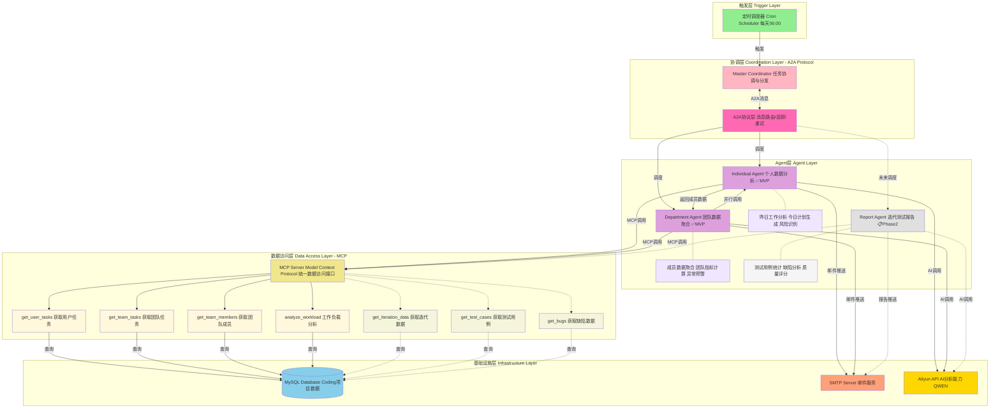
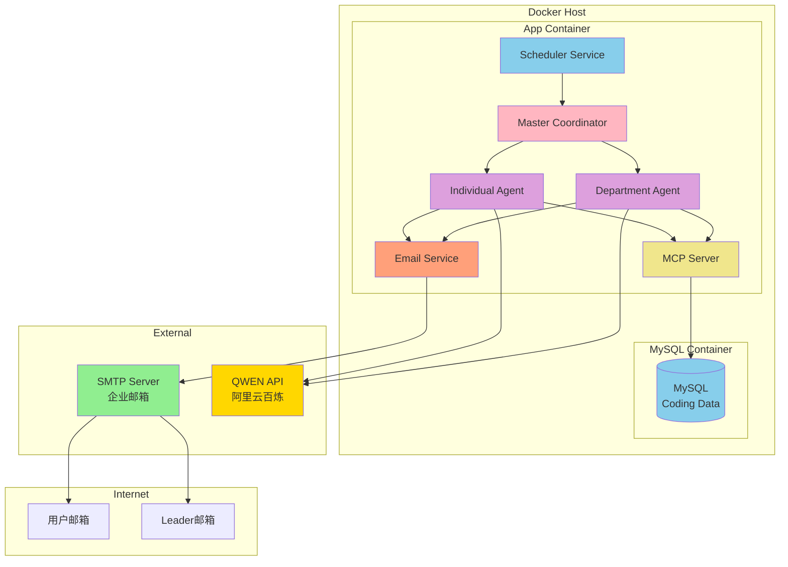

# DevOps Agent - 系统流程图

## 1. MVP整体架构流程图（简化版）


## 2. 系统逻辑架构图



## 3. 个人报告生成详细流程


## 3. 团队报告聚合流程


## 4. MCP Server工具调用流程


## 5. 邮件发送流程（含队列和重试）


## 6. 定时任务调度详细流程


## 7. 系统部署架构



## 8. 数据流转时序图


## 9. 错误处理流程


---

## 图表说明

### 核心架构图
1. **图1 - MVP整体架构流程图（简化版）**: 扁平化设计，快速理解核心流程
2. **图2 - 系统逻辑架构图**: 📐 **完整的分层架构**，展示各层职责和组件关系

### 详细流程图
3. **图3 - 个人报告生成详细流程**: Individual Agent的具体工作流程
4. **图4 - 团队报告聚合流程**: Department Agent如何并行处理和聚合数据
5. **图5 - MCP Server工具调用流程**: MCP如何处理工具调用并使用缓存
6. **图6 - 邮件发送流程**: 包含队列、批量发送、重试机制
7. **图7 - 定时任务调度详细流程**: Scheduler的完整执行过程

### 部署与运维
8. **图8 - 系统部署架构**: Docker容器部署结构
9. **图9 - 数据流转时序图**: 展示各组件间的交互时序
10. **图10 - 错误处理流程**: 异常情况的处理逻辑

---

## 架构层次说明

基于图2的系统逻辑架构，整个系统分为5个层次：

### 1️⃣ 触发层（Trigger Layer）
- **Cron Scheduler**: 每天早上06:00自动触发任务

### 2️⃣ 协调层（Coordination Layer - A2A Protocol）
- **Master Coordinator**:
  - 任务调度与分发
  - Agent生命周期管理
  - 结果聚合与格式化

- **A2A协议层**（核心创新点）:
  - **Agent-to-Agent通信协议**
  - 消息路由与转发
  - 请求追踪（trace_id）
  - 失败重试机制
  - 并行/串行调度控制
  - 内存消息队列（轻量级）

**A2A消息示例**:
```json
{
  "protocol": "A2A/1.0",
  "from": "department_agent",
  "to": "individual_agent",
  "action": "analyze_member",
  "trace_id": "uuid-123"
}
```

### 3️⃣ Agent层（Agent Layer）

#### ✅ MVP阶段
- **Individual Agent**: 个人数据分析
  - 昨日工作分析（完成任务、耗时统计）
  - 今日计划生成（优先级排序）
  - 风险识别（阻塞项、延期预警）
  - 输出：`StandupReport` JSON

- **Department Agent**: 团队数据聚合
  - 成员数据聚合（通过A2A调用Individual Agent）
  - 团队指标计算（完成率、速度、工时）
  - 异常预警（超负荷、阻塞、延期）
  - 输出：`DepartmentSummary` JSON

#### 📋 Phase 2扩展
- **Report Agent**: 迭代测试报告生成
  - 测试用例统计（执行率、通过率）
  - 缺陷分析（按严重程度、模块分布）
  - 质量评分（基于多维度指标）
  - 趋势预测（基于历史数据）
  - 输出：`TestReport` Markdown/PDF

### 4️⃣ 数据访问层（Data Access Layer - MCP）
- **MCP Server**: Model Context Protocol统一数据访问接口

#### MCP Tools - MVP阶段
  - `get_user_tasks` - 获取用户任务（支持日期范围、状态过滤）
  - `get_team_tasks` - 获取团队任务（支持分组聚合）
  - `get_team_members` - 获取团队成员列表
  - `analyze_workload` - 工作负载分析（统计+趋势）

#### MCP Tools - Phase 2扩展
  - `get_iteration_data` - 获取迭代数据（包含目标、任务、指标）
  - `get_test_cases` - 获取测试用例（执行状态、覆盖率）
  - `get_bugs` - 获取缺陷数据（严重程度、修复状态）

**MCP优势**:
- 统一的数据访问接口
- 自动缓存优化
- 参数验证
- 错误处理
- 便于扩展新工具

### 5️⃣ 基础设施层（Infrastructure Layer）
- **MySQL Database**:
  - Coding项目数据存储
  - 表结构：tasks、users、teams、iterations、test_cases、bugs
  - 所有业务数据的持久化存储

- **SMTP Server**:
  - 邮件发送服务
  - 批量发送（20封/批）
  - 速率限制（100封/分钟）
  - 失败重试（最多3次）
  - 支持HTML模板渲染

### 🌐 外部服务（External Services）
- **阿里云百炼 - QWEN API**:
  - 提供AI分析能力
  - 自然语言生成
  - 数据洞察提取
  - 智能建议生成

- **Email Client**:
  - 用户接收邮件的客户端
  - 个人用户：每日站会报告
  - Leader：团队汇总报告
  - 测试团队：迭代测试报告（Phase 2）

---

## 关键特性

### 🔄 A2A协议的优势
1. **解耦合**: Agent之间通过标准协议通信，易于扩展
2. **可追踪**: 每个请求都有trace_id，便于问题排查
3. **高可用**: 支持失败重试和降级策略
4. **并行化**: Department Agent可并行调用多个Individual Agent

### 📊 Phase 2扩展能力
1. **迭代测试报告**:
   - 自动生成测试报告（每个迭代结束时）
   - 测试覆盖率分析
   - 缺陷趋势预测
   - 质量度量看板

2. **数据可视化**:
   - 集成ECharts生成图表
   - 趋势曲线、饼图、雷达图
   - 导出为PDF/HTML格式

3. **智能建议**:
   - 基于历史数据的AI建议
   - 资源分配优化
   - 风险预测预警

---

这些流程图可以直接在支持Mermaid的Markdown查看器中渲染，如GitHub、GitLab、VS Code等。
